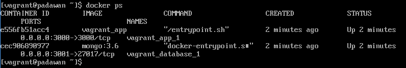

#Using Docker With Vagrant

This is currently only working with VirtualBox.  To do that HyperV ***MUST*** be turned off.

##Installations
I use the git bash shell to do all of the following.
1.  Clone padawan with the vagrantDocker branch.
2.  Install [Vagrant](https://www.vagrantup.com/docs/installation/)
3.  Run ```vagrant plugin install docker-compose```
4.  Run ```vagrant plugin install vagrant-vbguest```
5.  Insure that there is no padawan/.meteor/local dir.  **This must be done EVERYTIME ```vagrant up``` is run!!**
6.  Copy padawan/docker/vagrant/entrypoint.sh to padawan.
7.  Make sure VirtualBox is installed ( [VirtualBox Downloads](https://www.virtualbox.org/wiki/Downloads) if you have to install VirtualBox, restart shell window).
8.  Make sure that "D:/Programs/Oracle/VirtualBox/VBoxGuestAdditions.iso" exists.  You may have to edit the padawan/Vagrantfile to the correct location for your VBoxGuestAdditions.iso.

##Running
#####Do

***A.***
1.  Run ```vagrantDock.sh```

#####OR
   
***B.*** 
1.  Run ```dos2unix *.* ``` in the padawan and padawan/docker/vagrant directories.  This will change all of those pesky windows CRLFs into Unix line endings.
2.  Run ```vagrant up```.

#####Finally
3.  A VirtualBox VM should appear.
4.  Wait a few minutes, Open a browser and to enter ```localhost:3000``` as the URL.

##Troubleshooting
1.  If you get errors like 'symlink has no referent: "/cygdrive/d/PaladinArcher/padCurr/padawan/.meteor/local/build/programs/server/npm/node_modules/meteor/webapp/node_modules/qs-middleware"', see **Installations #3**.
2.  If you get errors like 'standard_init_linux.go:207: exec user process caused "no such file or directory" ', see **Running #1**.
3.  If it just doesn't seem to work, first try **Running #1**.
4.  To try and dig deeper into problems try logging into the VirtualBox VM.
    A.  User name: vagrant with password :vagrant.
    B.  Try ```docker ps```.  You should see something like:
       Explore from there.
    
    
 